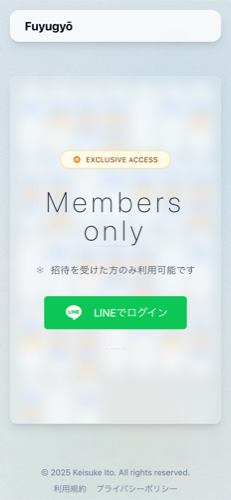
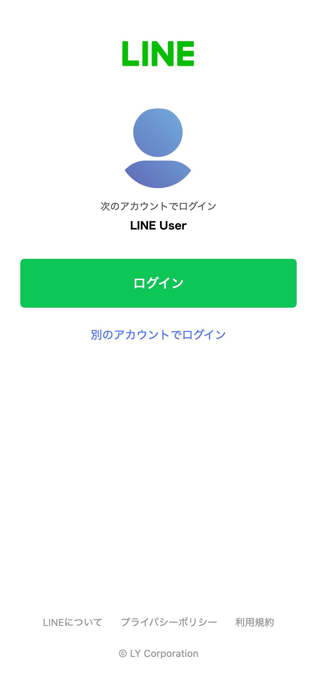
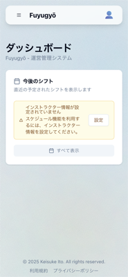
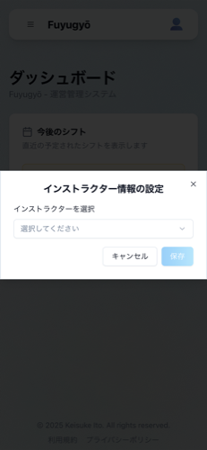
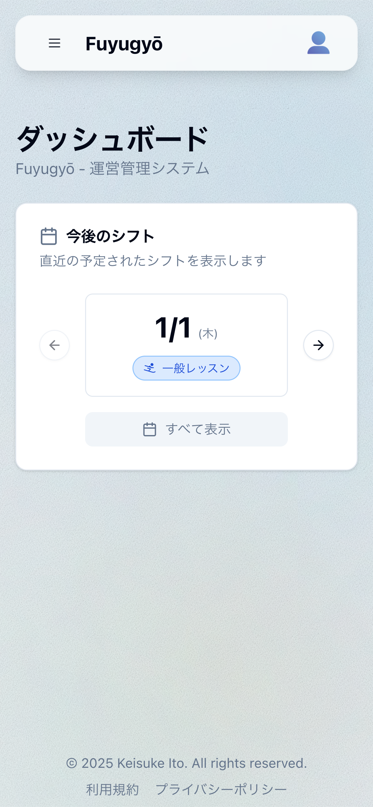
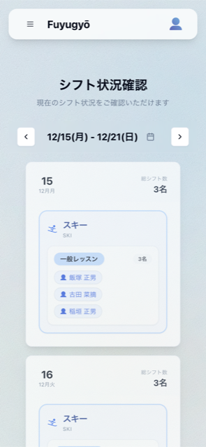
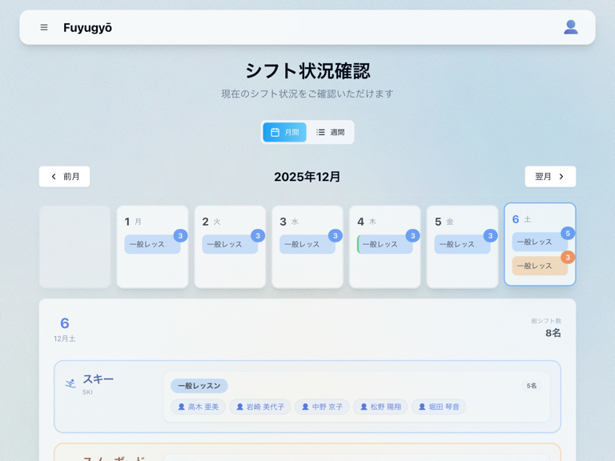
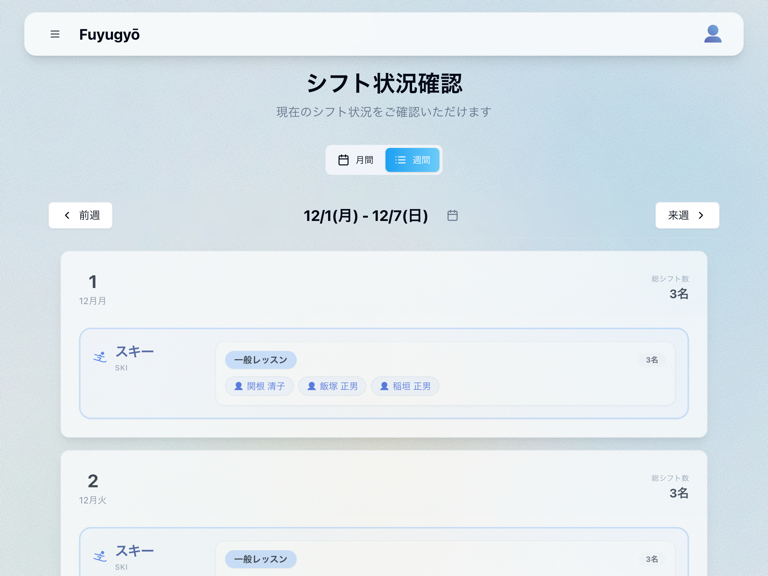
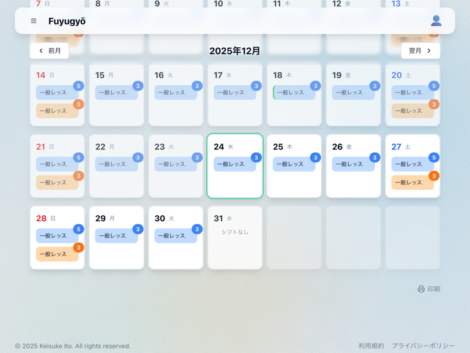
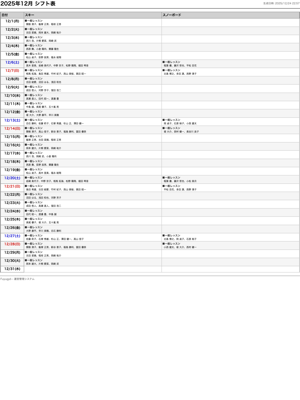

# メンバー向け利用マニュアル

このマニュアルでは、本システムのメンバー向け利用方法について説明します。

## 1. 招待〜ログイン

本システムを利用するには、まず管理者からの招待が必要です。

1.  **招待依頼**
    所属するスクールの管理者に、システムへの招待を依頼してください。

2.  **招待リンクの確認**
    管理者から招待リンクが共有されます。共有された招待リンクをタップしてください。

3.  **LINE でログイン**
    招待リンクにアクセスすると、ログイン画面が表示されます。
    「LINE でログイン」ボタンをタップしてください。

    

    通常、LINE アプリが起動し認証が完了しますが、場合によっては LINE のログイン画面が表示されることがあります。その際は、LINE に登録しているメールアドレスとパスワードを入力して認証を完了させてください。

    

    認証が完了すると、自動的にユーザー登録とログインが行われます。

## 2. インストラクターの紐付け

ログイン後、ご自身のユーザーアカウントとインストラクター情報を紐付ける必要があります。これにより、自分のシフトが確認しやすくなります。

1.  **初回ログイン時**
    初回ログイン後、ダッシュボード（トップページ）にインストラクター情報を設定するよう促すメッセージが表示されます。メッセージ内の「設定」ボタンをタップしてください。

    

2.  **自分の名前を選択**
    インストラクター選択画面が表示されたら、ドロップダウンリストの中からご自身の名前を選択し、「保存」ボタンをタップしてください。

    

3.  **ダッシュボードについて**
    これで、あなたのアカウントとインストラクター情報が紐付けられました。ヘッダーのユーザー名が、選択したインストラクター名で表示されるようになります。紐付けを行わなくてもシフトの確認は可能ですが、自分のシフトのハイライト機能などは利用できません。

    

## 3. シフトの確認方法

シフト確認ページでは、紐付けが完了していなくてもシフトを確認できます。インストラクター情報の紐付けを行うことで、自分のシフトがハイライト表示されるようになります。

1.  **シフトページへ移動**
    ダッシュボードから「全て表示」をタップするか、メニュー（≡ アイコン）から「シフト」を選択し、シフト確認ページに移動します。

    

2.  **表示モードの切り替え**
    シフトページは、デフォルトで週間表示になっています。
    PC など画面幅が大きい端末で表示すると、月間ビューを利用できるようになります。

    - **月間表示**: 画面上部にある「月間」タブをクリックすると、カレンダー形式の月間表示に切り替わります。

    

    - **週間表示**: 「週間」タブをクリックすると、週間表示に戻ります。

    

## 4. シフトの印刷方法

月間シフトは、印刷用のレイアウトで PDF として保存したり、紙に印刷したりすることができます。

1.  **印刷ボタンをクリック**
    シフトページを「月間」表示に切り替えます。
    画面右上にあるプリンターのアイコン（🖨️）が付いた「印刷」ボタンをクリックしてください。

    

2.  **印刷**
    クリックすると、デザイン要素を排した印刷に適した画面が表示されます。
    この画面で、ブラウザの印刷機能（通常は `Ctrl + P` または `Command + P`）を使用して印刷を行ってください。
    プリンターの選択や「PDF として保存」は、ブラウザの印刷ダイアログから設定できます。
    内容を確認し、印刷を完了してください。

    
