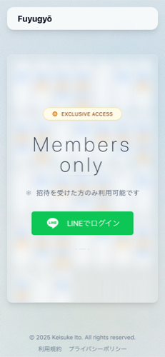
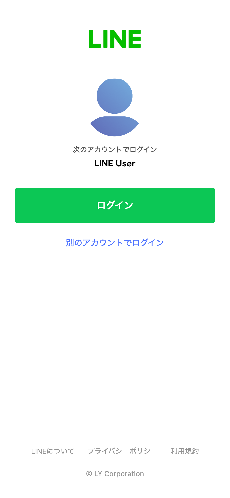
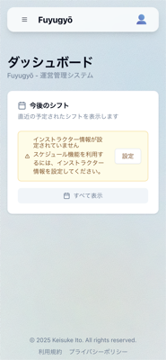
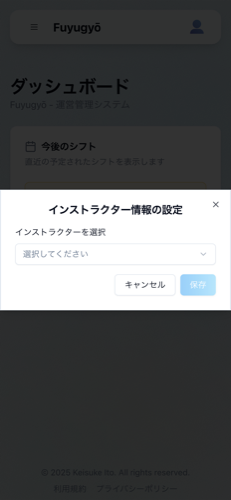
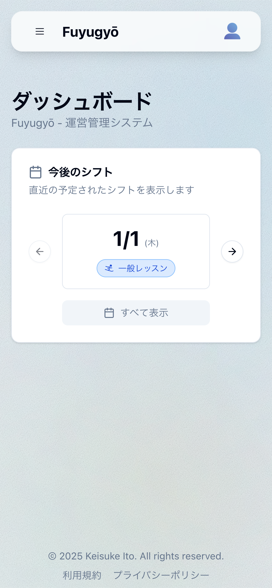
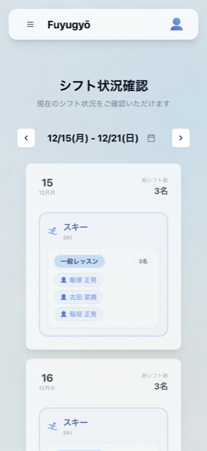
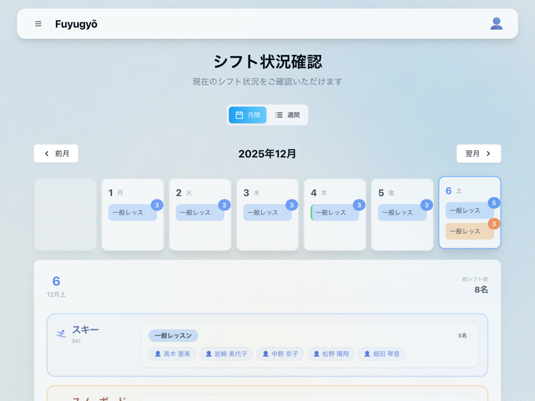
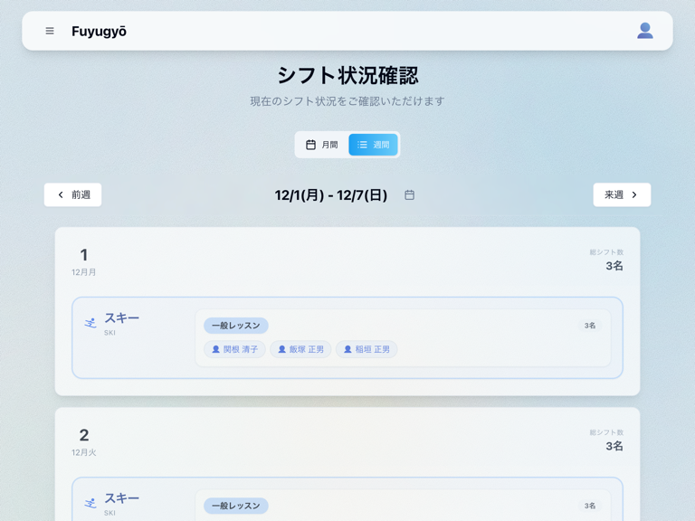

# メンバー向け利用マニュアル

このマニュアルでは、本システムのメンバー向け利用方法について説明します。

## 1. 招待〜ログイン

本システムを利用するには、まず管理者からの招待が必要です。

1.  **招待依頼**
    所属するスクールの管理者に、システムへの招待を依頼してください。

2.  **招待リンクの確認**
    管理者から招待リンクが共有されます。共有された招待リンクをタップしてください。

3.  **LINE でログイン**
    招待リンクにアクセスすると、ログイン画面が表示されます。
    「LINE でログイン」ボタンをタップしてください。

    

    通常、LINE アプリが起動し認証が完了しますが、場合によっては LINE のログイン画面が表示されることがあります。その際は、LINE に登録しているメールアドレスとパスワードを入力して認証を完了させてください。

    

    認証が完了すると、自動的にユーザー登録とログインが行われます。

## 2. インストラクターの紐付け

ログイン後、ご自身のユーザーアカウントとインストラクター情報を紐付ける必要があります。これにより、自分のシフトが確認しやすくなります。

1.  **初回ログイン時**
    初回ログイン後、ホーム（トップページ）にインストラクター情報を設定するよう促すメッセージが表示されます。メッセージ内の「設定」ボタンをタップしてください。

    

2.  **自分の名前を選択**
    インストラクター選択画面が表示されたら、ドロップダウンリストの中からご自身の名前を選択し、「保存」ボタンをタップしてください。

    

3.  **ホームについて**
    これで、あなたのアカウントとインストラクター情報が紐付けられました。ヘッダーのユーザー名が、選択したインストラクター名で表示されるようになります。紐付けを行わなくてもシフトの確認は可能ですが、自分のシフトのハイライト機能などは利用できません。

    

## 3. シフトの確認方法

シフト確認ページでは、紐付けが完了していなくてもシフトを確認できます。インストラクター情報の紐付けを行うことで、自分のシフトがハイライト表示されるようになります。

1.  **シフトページへ移動**
    ホームから「全て表示」をタップするか、メニュー（≡ アイコン）から「シフト」を選択し、シフト確認ページに移動します。

    

2.  **表示モードの切り替え**
    シフトページは、デフォルトで週間表示になっています。
    PC など画面幅が大きい端末で表示すると、月間ビューを利用できるようになります。

    - **月間表示**: 画面上部にある「月間」タブをクリックすると、カレンダー形式の月間表示に切り替わります。

    

    - **週間表示**: 「週間」タブをクリックすると、週間表示に戻ります。

    

## 4. シフトの印刷方法

月間シフト表を印刷用のレイアウトで表示し、紙に印刷したり PDF として保存したりできます。

1.  **印刷する月と部門を選ぶ**
    シフト確認ページ上部の「印刷」ボタンをクリックすると、印刷条件のダイアログが開きます。

    - **対象月**: 初期値は、ボタンを押した時点で画面の一番上に見えている日付の月です。別の月を印刷したいときは、入力欄をクリックしてカレンダーから選び直してください。ダイアログを開いた後は、選んだ月が勝手に変わることはありません。
    - **部門**: 「両部門」「スキーのみ」「スノーボードのみ」から選びます。初期値は両部門です。

    シフト確認ページの絞り込み（部門・「自分だけ」）は印刷には引き継がれず、常に全担当者が印刷されます。

2.  **印刷用ページを開く**
    「印刷用ページを開く」ボタンをクリックすると、別のタブで印刷用ページが開きます。
    元のシフト確認ページはそのまま残るため、印刷後もスクロール位置を保ったまま閲覧を続けられます。

    月初から月末までの全日付が縦に並びます。担当者がいない日は、その場で手書きできる空欄になります。

3.  **印刷**
    印刷用ページを開いただけでは印刷画面は開きません。ページ右上の「印刷」ボタンをクリックすると、ブラウザの印刷画面が開きます。
    プリンターの選択や「PDF として保存」は、ブラウザの印刷ダイアログから設定できます。
    用紙は A4 縦・白黒での印刷を想定しています。余白は「デフォルト」、倍率は 100% のまま印刷してください。
    読みやすい文字の大きさと手書き用の空欄を保つため、1 か月は 2 ページ程度に分かれます（担当者や種別が多い月はさらに増えます）。1 枚に収めるために文字を小さくすることはありません。
    同じ日付の内容は、ページの前後に分かれません（1 日分の担当者が 1 ページに収まらないほど多い場合のみ分かれます）。2 ページ目以降にも「日付・部門」の見出しと対象年月が印刷されます。
    操作ボタンやナビゲーションは印刷されません。
